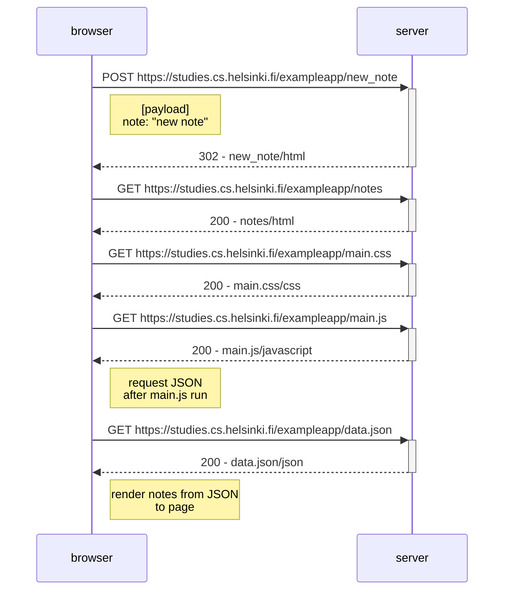

```mermaid
    sequenceDiagram
        participant browser
        participant server

        browser ->>+ server: POST https://studies.cs.helsinki.fi/exampleapp/new_note
        Note right of browser: [payload]<br/>note: "new note"
        server -->>- browser: 302 - new_note/html
        browser ->>+ server: GET https://studies.cs.helsinki.fi/exampleapp/notes
        server -->>- browser: 200 - notes/html
        browser ->>+ server: GET https://studies.cs.helsinki.fi/exampleapp/main.css
        server -->>- browser: 200 - main.css/css
        browser ->>+ server: GET https://studies.cs.helsinki.fi/exampleapp/main.js
        server -->>- browser: 200 - main.js/javascript
        Note right of browser: request JSON<br/> after main.js run
        browser ->>+ server: GET https://studies.cs.helsinki.fi/exampleapp/data.json
        server -->>- browser: 200 - data.json/json
        Note right of browser: render notes from JSON<br/> to page
```
