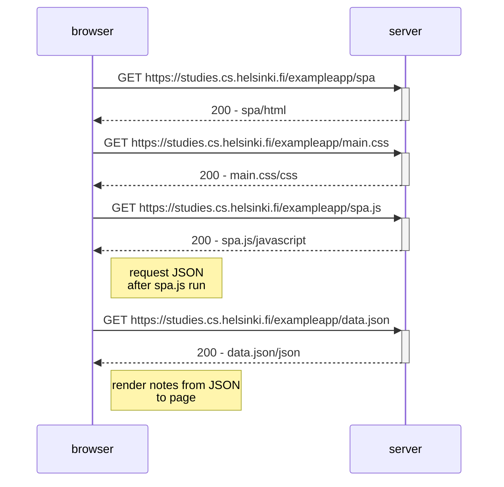

```mermaid
    sequenceDiagram
        participant browser
        participant server

        browser ->>+ server: GET https://studies.cs.helsinki.fi/exampleapp/spa
        server -->>- browser: 200 - spa/html
        browser ->>+ server: GET https://studies.cs.helsinki.fi/exampleapp/main.css
        server -->>- browser: 200 - main.css/css
        browser ->>+ server: GET https://studies.cs.helsinki.fi/exampleapp/spa.js
        server -->>- browser: 200 - spa.js/javascript
        Note right of browser: request JSON<br/> after spa.js run
        browser ->>+ server: GET https://studies.cs.helsinki.fi/exampleapp/data.json
        server -->>- browser: 200 - data.json/json
        Note right of browser: render notes from JSON<br/> to page
```
